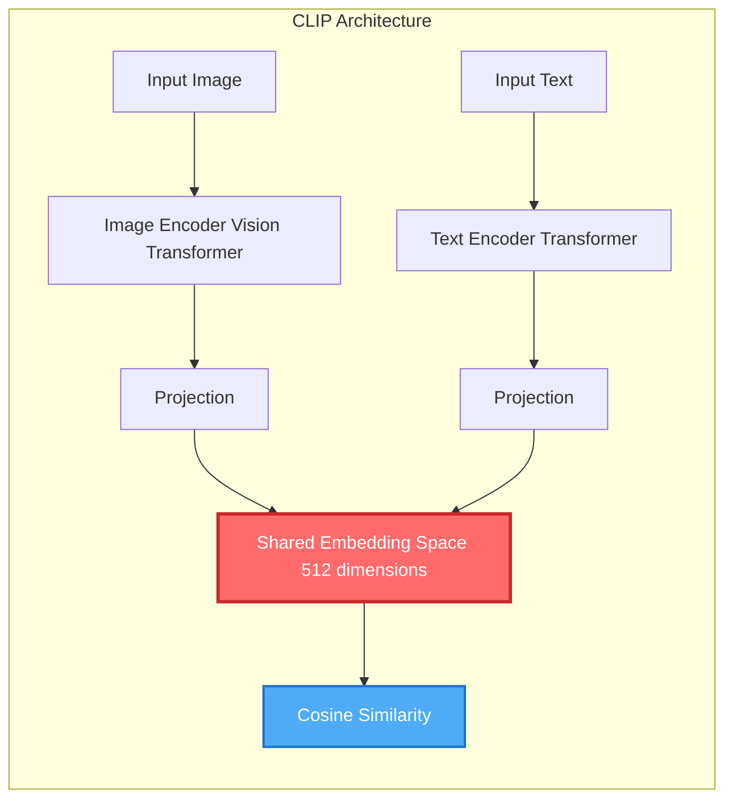
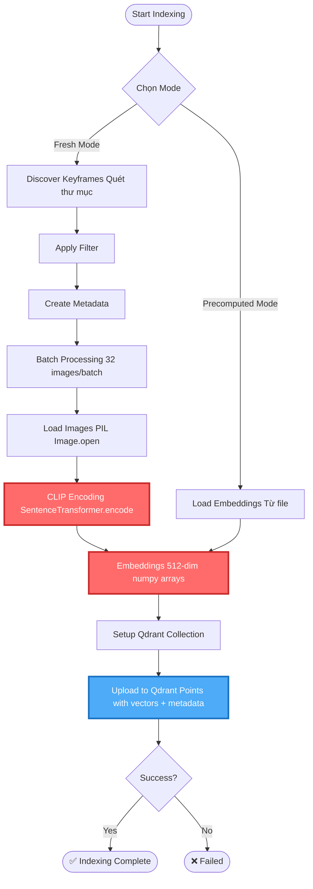
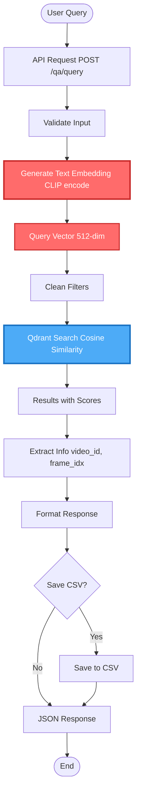
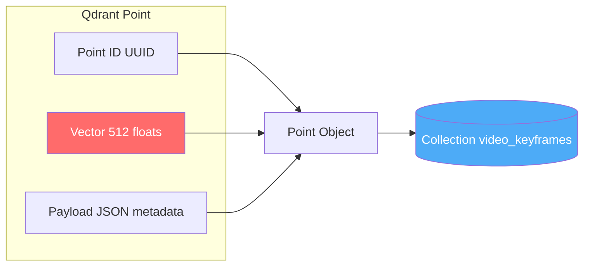
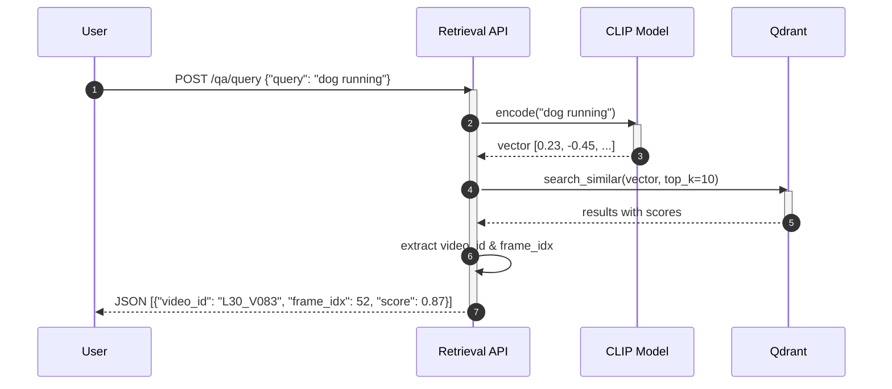

# AI Components Deep Dive

## CLIP Model - Core AI Technology

### What is CLIP?

**CLIP** (Contrastive Language-Image Pre-training) is a multimodal AI model developed by OpenAI that understands both images and text in a shared embedding space.



### Why CLIP?

✅ **Multimodal**: Hiểu cả hình ảnh và văn bản  
✅ **Zero-shot learning**: Không cần training lại  
✅ **Semantic understanding**: Hiểu ngữ nghĩa, không chỉ pixel  
✅ **Pre-trained**: Trained trên 400M image-text pairs  

### Technical Specifications

| Property | Value |
|----------|-------|
| **Model** | `sentence-transformers/clip-ViT-B-32` |
| **Embedding Dimension** | 512 |
| **Input** | Images (RGB) + Text |
| **Output** | 512-dim vectors |
| **Device** | GPU (CUDA) / CPU fallback |

## Indexing Pipeline

### Flow Diagram



### Code Implementation

**Generate Embeddings**:
```python
def generate_batch_embeddings(self, image_paths: List[str]) -> List[np.ndarray]:
    batch_size = 32
    embeddings = []
    
    for i in range(0, len(image_paths), batch_size):
        batch_paths = image_paths[i:i + batch_size]
        batch_images = [Image.open(path).convert('RGB') for path in batch_paths]
        
        # CLIP encoding
        batch_embeddings = self.model.encode(batch_images, convert_to_numpy=True)
        embeddings.extend(batch_embeddings)
    
    return embeddings
```

**Performance Optimization**:
- Batch processing: 32 images at once
- GPU acceleration: ~100 images/sec
- Error handling: Zero vectors for corrupted images
- Progress tracking: tqdm progress bars

## Retrieval Pipeline

### Flow Diagram



### Code Implementation

**Search Similar Vectors**:
```python
def search_similar(self, query_embedding: np.ndarray, limit: int = 10):
    search_results = self.qdrant_client.search(
        collection_name="video_keyframes",
        query_vector=query_embedding,
        limit=limit,
        score_threshold=0.7  # Minimum similarity
    )
    
    results = []
    for result in search_results:
        results.append({
            "score": result.score,
            "payload": result.payload
        })
    
    return results
```

## Vector Database (Qdrant)

### Why Vector Database?

Traditional DB:
```sql
SELECT * FROM videos WHERE title LIKE '%dog%'
```
❌ Can't understand semantics

Vector DB:
```python
search(query_vector=[0.23, -0.45, ...], top_k=10)
```
✅ Finds semantically similar content

### HNSW Algorithm

**HNSW** (Hierarchical Navigable Small World):
- Graph-based ANN (Approximate Nearest Neighbor)
- Multi-layer structure
- Search complexity: O(log N)
- Trade-off: 99% accuracy with 100x speed

### Data Structure



**Example Payload**:
```json
{
  "keyframe_path": "/path/to/L30_V083/052.jpg",
  "frame_idx": 52,
  "video_id": "L30_V083"
}
```

## Sequence Diagram: End-to-End Query



## Performance Metrics

| Metric | Value |
|--------|-------|
| **Indexing Speed** | ~100 images/sec (GPU) |
| **Search Latency** | &lt;100ms |
| **Accuracy** | Top-10 recall ~85% |
| **Embedding Dimension** | 512 |
| **Batch Size** | 32 images |

## Next Steps

- [Technology Stack Details →](./tech-stack)
