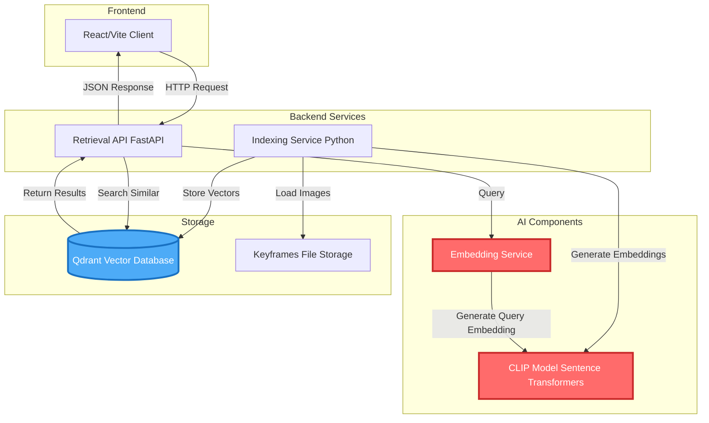
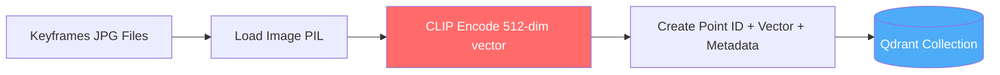
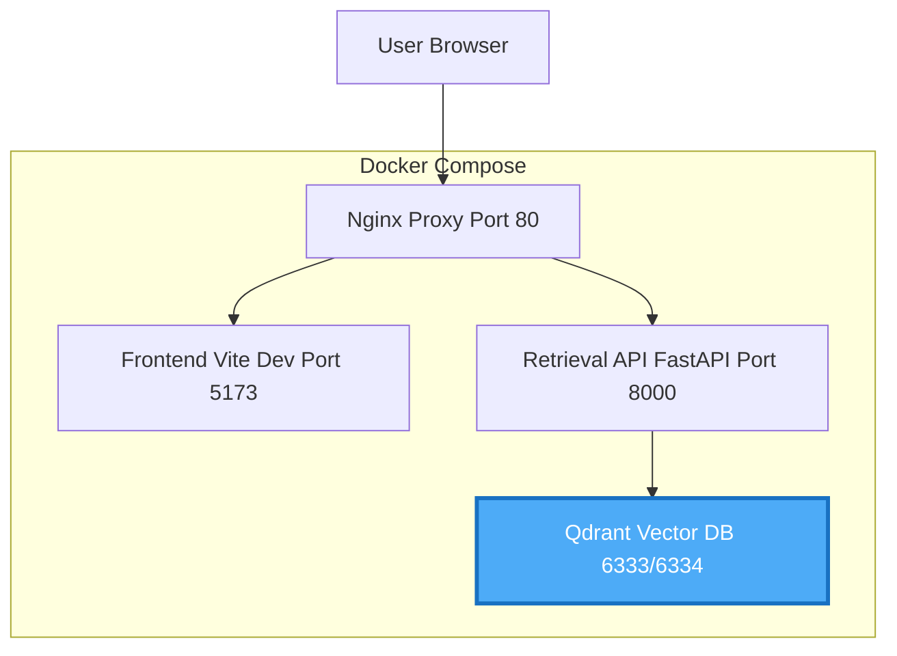

# System Architecture

## High-Level Architecture



## Clean Architecture Layers

```mermaid
graph TB
    subgraph "Presentation Layer"
        FAST[FastAPI Routes api/routers/qa.py]
        MAIN[Main Entry main.py]
    end
    
    subgraph "Application Layer"
        QA[QA Service application/qa.py]
        KIS[KIS Service]
        TRAKE[TRAKE Service]
    end
    
    subgraph "Domain Layer"
        INTERFACE[BaseRetrievalService interfaces/base_retrieval.py]
        MODELS[Domain Models BaseModel]
    end
    
    subgraph "Infrastructure Layer"
        EMB_INFRA[Embedding Client infra/embedding.py]
        QDRANT_INFRA[Qdrant Client infra/qdrant.py]
    end
    
    subgraph "External"
        CLIP_EXT[CLIP Model]
        QDRANT_EXT[(Qdrant DB)]
    end
    
    FAST --> QA
    MAIN --> FAST
    QA --> INTERFACE
    KIS --> INTERFACE
    TR AKE --> INTERFACE
    
    INTERFACE --> EMB_INFRA
    INTERFACE --> QDRANT_INFRA
    
    EMB_INFRA --> CLIP_EXT
    QDRANT_INFRA --> QDRANT_EXT
    
    style INTERFACE fill:#fab005,stroke:#f08c00,stroke-width:2px
    style CLIP_EXT fill:#ff6b6b,stroke:#c92a2a,stroke-width:3px,color:#fff
    style QDRANT_EXT fill:#4dabf7,stroke:#1971c2,stroke-width:3px,color:#fff
```

## Component Breakdown

### 1. Indexing Service (`indexing/`)

**Purpose**: Generate CLIP embeddings from video keyframes and upload to Qdrant

**Flow**:
1. Discover keyframes from file system
2. Load images in batches (batch_size: 32)
3. Generate embeddings using CLIP model
4. Create metadata (keyframe_path, frame_idx, video_id)
5. Upload to Qdrant with vectors + payload

**Key Files**:
- `main.py` - Entry point, supports fresh/precomputed modes
- `application/fresh_run.py` - Fresh embedding generation
- `infra/embedding_service.py` - CLIP model wrapper
- `infra/qdrant.py` - Qdrant client wrapper

### 2. Retrieval API (`retrieve/`)

**Purpose**: Serve search requests and return relevant video frames

**Flow**:
1. Receive text query from client
2. Generate query embedding using CLIP
3. Search Qdrant for similar vectors (cosine similarity)
4. Extract video_id and frame_idx from results
5. Return ranked results to client

**Key Files**:
- `main.py` - FastAPI application
- `api/routers/qa.py` - Query endpoint
- `application/qa.py` - QA service logic
- `infra/qdrant.py` - Qdrant search client

### 3. Vector Database (Qdrant)

**Configuration**:
- Collection: `video_keyframes`
- Vector size: 512 dimensions
- Distance metric: Cosine similarity
- Ports: 6333 (HTTP), 6334 (gRPC)

## Data Flow Example

### Indexing Flow



### Retrieval Flow


## Deployment Architecture



## Next Steps

- [AI Components Deep Dive →](./ai-components)
- [Technology Stack Details →](./tech-stack)
