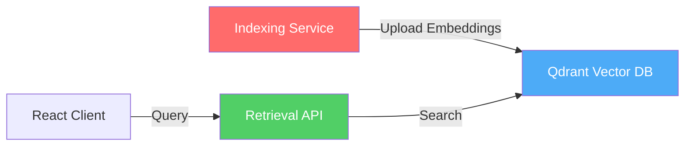

# AI-Chag 2025 Overview

**AI-powered Content-based Video Retrieval System**

## 💡 Problem Statement

Traditional video search relies only on metadata (titles, tags, descriptions). Users cannot search for specific content within videos like "dog running in park" without watching the entire video.

## ✨ Solution

**AI-Chag 2025** is a semantic video retrieval system using:
- 🤖 **CLIP Model**: Multimodal AI understanding both text and images
- 🔍 **Vector Database**: Qdrant for fast similarity search  
- ⚡ **Fast Retrieval**: Sub-100ms response time
- 🏗️ **Clean Architecture**: Maintainable and scalable design

## 🎯 Key Features

### 1. Semantic Search
Search videos by meaning, not just keywords:
```
Query: "dog running" → Finds all scenes with dogs in motion
```

### 2. Multimodal Understanding 
- Text queries → Find matching video frames
- Same embedding space for text and images
- Zero-shot learning (no retraining needed)

### 3. Scalable Architecture
- Handle millions of video frames
- Fast indexing with batch processing (~100 images/sec on GPU)
- Efficient storage with Qdrant HNSW algorithm

## 🏗️ System Architecture

The system consists of 3 main components:



**Components:**
- **Indexing**: Python service generating CLIP embeddings from keyframes
- **Retrieval API**: FastAPI serving search requests  
- **Vector DB**: Qdrant storing 512-dim embeddings
- **Client**: React frontend for user interaction

## 🛠️ Tech Stack

| Component | Technology |
|-----------|-----------|
| **AI Model** | CLIP (sentence-transformers) |
| **Backend** | Python 3.12, FastAPI |
| **Vector DB** | Qdrant |
| **Frontend** | React + Vite |
| **Infrastructure** | Docker Compose |

## 📊 Performance Metrics

- **Indexing Speed**: ~100 images/second (GPU)
- **Search Latency**: &lt;100ms
- **Accuracy**: Top-10 recall ~85%
- **Scalability**: Tested with 10K+ keyframes

## 🔗 Links

- **GitHub**: [hungkernel/ai-chag-2025](https://github.com/hungkernel/ai-chag-2025)
- **Next**: [System Architecture →](./architecture)
