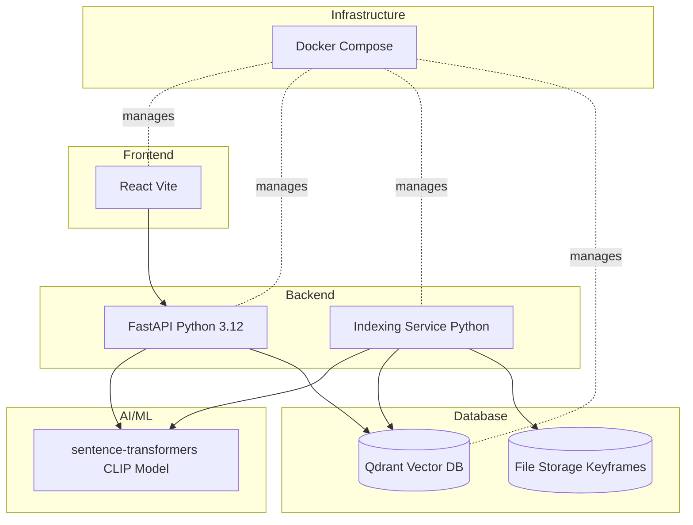

# Technology Stack

## Overview



## Core Technologies

### Backend - Python 3.12

**Framework**: FastAPI
- Modern async web framework
- Automatic OpenAPI/Swagger docs
- Type hints with Pydantic
- High performance (Starlette + Uvicorn)

**Key Dependencies**:
```toml
[dependencies]
fastapi = "^0.100.0"
uvicorn = "^0.23.0"
python = "^3.12"
```

### AI/ML - Sentence Transformers

**Model**: `clip-ViT-B-32`
- Vision Transformer architecture
- 512-dimensional embeddings
- Pre-trained on LAION-400M dataset

**Installation**:
```bash
pip install sentence-transformers
```

**Usage**:
```python
from sentence_transformers import SentenceTransformer

model = SentenceTransformer('clip-ViT-B-32')
embedding = model.encode("dog running")  # 512-dim vector
```

### Vector Database - Qdrant

**Version**: Latest
**Deployment**: Docker container

**Configuration**:
```yaml
qdrant:
  image: qdrant/qdrant
  ports:
    - 6333:6333  # HTTP
    - 6334:6334  # gRPC
  volumes:
    - ./data/qdrant_data:/qdrant/storage
```

**Client**:
```python
from qdrant_client import QdrantClient

client = QdrantClient(url="http://localhost:6333")
```

### Frontend - React + Vite

**Build Tool**: Vite
- Fast HMR (Hot Module Replacement)
- Optimized production builds
- Modern ES modules

**Configuration**:
```typescript
// vite.config.ts
import { defineConfig } from 'vite'
import react from '@vitejs/plugin-react'

export default defineConfig({
  plugins: [react()],
  server: {
    port: 5173
  }
})
```

## Development Stack

### Package Management

**Indexing & Retrieval**: `uv` (modern Python package manager)
```toml
[tool.uv]
dev-dependencies = ["pytest", "black", "mypy"]
```

**Frontend**: `pnpm`
```json
{
  "packageManager": "pnpm@8.0.0"
}
```

### Code Quality

**Python**:
- Type checking: `mypy`
- Code formatting: `black`
- Linting: `ruff`

**TypeScript**:
- ESLint configuration
- Prettier formatting
- Strict TypeScript mode

## Infrastructure

### Docker Compose

**Services**:
1. **Qdrant** - Vector database
2. **Frontend** - React development server (optional)
3. **Nginx** - Reverse proxy (optional)

**docker-compose.dev.yml**:
```yaml
version: '3.8'

services:
  qdrant:
    image: qdrant/qdrant
    ports:
      - 6333:6333
      - 6334:6334
    volumes:
      - ./data/qdrant_data:/qdrant/storage
    restart: always

  frontend:
    build:
      context: ./client
      dockerfile: Dockerfile.dev
    ports:
      - 5173:5173
    environment:
      VITE_API_URL: http://localhost:8000
```

### Local Development

**Start Qdrant**:
```bash
docker-compose up -d qdrant
```

**Run Indexing**:
```bash
cd indexing
uv run python main.py
```

**Run Retrieval API**:
```bash
cd retrieve
uv run uvicorn main:app --reload --port 8000
```

**Run Frontend**:
```bash
cd client
pnpm install
pnpm dev
```

## Project Structure

```
ai-chag-2025/
├── indexing/              # Indexing service
│   ├── application/       # Business logic
│   ├── domain/           # Domain models
│   ├── infra/            # CLIP, Qdrant clients
│   ├── shared/           # Settings, logger
│   ├── main.py           # Entry point
│   └── pyproject.toml    # Dependencies
│
├── retrieve/             # Retrieval API
│   ├── api/             # FastAPI routes
│   ├── application/     # QA, KIS, TRAKE services
│   ├── domain/          # Interfaces, models
│   ├── infra/           # Embedding, Qdrant, Gemini
│   ├── shared/          # Utils, settings
│   ├── main.py          # FastAPI app
│   └── pyproject.toml
│
├── client/              # React frontend
│   ├── src/
│   ├── vite.config.ts
│   └── package.json
│
├── resources/           # Keyframes storage
│   └── documents/
│
└── docker-compose.dev.yml
```

## API Documentation

### FastAPI Automatic Docs

**Swagger UI**: http://localhost:8000/docs  
**ReDoc**: http://localhost:8000/redoc

**Example Endpoint**:
```python
@app.post("/qa/query")
async def query(request: QAInput) -> QAOutput:
    """
    Search for similar video frames based on text query.
    
    Args:
        request: Query input with text, filters, top_k
        
    Returns:
        Search results with video_id, frame_idx, scores
    """
    service = QAService(settings=get_settings())
    return service.process(request)
```

## Environment Configuration

### Settings Management

**Pydantic BaseSettings**:
```python
from pydantic_settings import BaseSettings

class Settings(BaseSettings):
    # Qdrant
    qdrant_url: str = "http://localhost:6333"
    collection_name: str = "video_keyframes"
    
    # CLIP
    embedding_model: str = "clip-ViT-B-32"
    
    # Processing
    batch_size: int = 32
    
    class Config:
        env_file = ".env"
```

**Environment Variables**:
```bash
# .env
QDRANT_URL=http://localhost:6333
EMBEDDING_MODEL=clip-ViT-B-32
BATCH_SIZE=32
```

## Deployment

### Production Build

**Frontend**:
```bash
cd client
pnpm build
# Output: dist/
```

**Backend**:
```bash
# Use production ASGI server
gunicorn main:app -w 4 -k uvicorn.workers.UvicornWorker
```

### Docker Production

```dockerfile
# Dockerfile (retrieve)
FROM python:3.12-slim

WORKDIR /app
COPY pyproject.toml uv.lock ./
RUN pip install uv && uv sync --frozen

COPY . .
CMD ["uv", "run", "uvicorn", "main:app", "--host", "0.0.0.0", "--port", "8000"]
```

## External Links

- [FastAPI Documentation](https://fastapi.tiangolo.com/)
- [Sentence Transformers](https://www.sbert.net/)
- [Qdrant Documentation](https://qdrant.tech/documentation/)
- [CLIP Paper](https://arxiv.org/abs/2103.00020)
