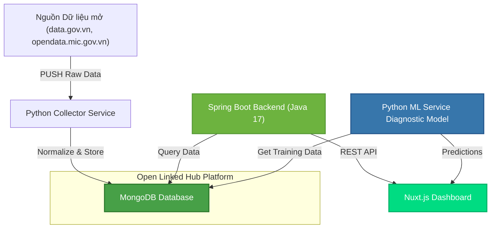
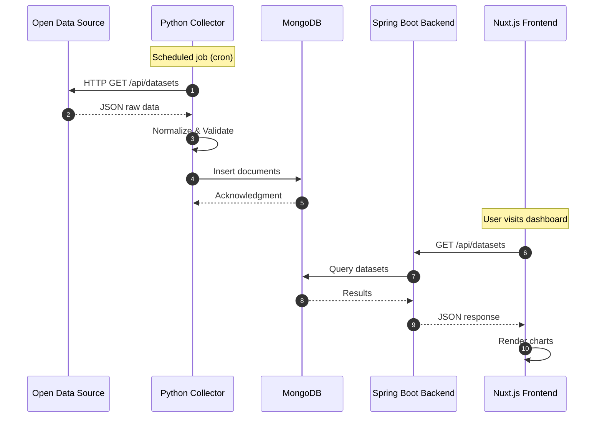
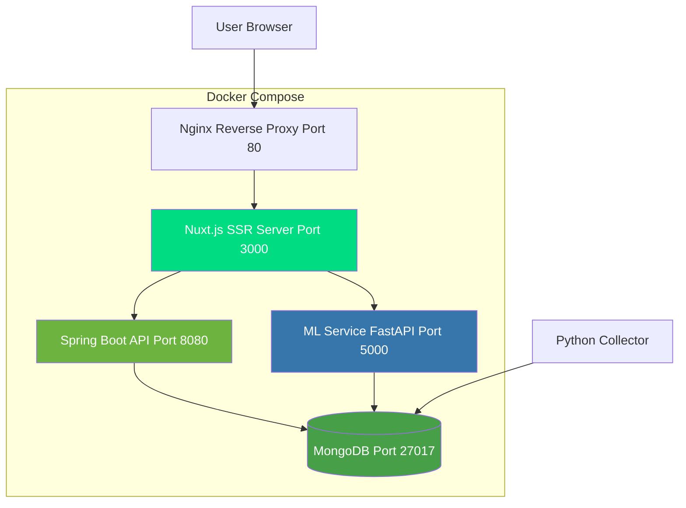
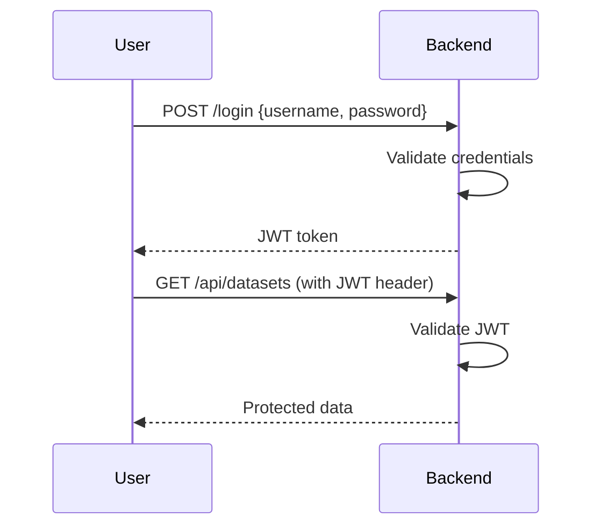

# System Architecture

## Data Flow Architecture



## Component Breakdown

### 1. Python Collector Service

**Purpose**: Tự động thu thập dữ liệu từ các nguồn mở

**Features**:
- HTTP requests đến các API nguồn mở
- Parse và normalize dữ liệu về JSON
- Validate và clean data
- Batch insert vào MongoDB

**Libraries**:
```python
import requests
import pandas as pd
from pymongo import MongoClient
```

**Example Workflow**:
```python
# 1. Fetch data from open data source
response = requests.get("https://data.gov.vn/api/dataset")
raw_data = response.json()

# 2. Normalize to standard format
df = pd.DataFrame(raw_data)
normalized = df.to_dict('records')

# 3. Insert to MongoDB
collection.insert_many(normalized)
```

### 2. MongoDB - Open Linked Hub

**Purpose**: Cơ sở dữ liệu tập trung cho dữ liệu mở

**Collections**:
- `datasets` - Metadata về datasets
- `indicators` - Chỉ số chuyển đổi số
- `provinces` - Dữ liệu địa phương
- `statistics` - Thống kê tổng hợp

**Schema Example**:
```json
{
  "_id": "ObjectId",
  "dataset_name": "Digital Transformation Index 2024",
  "province": "Hanoi",
  "indicators": {
    "infrastructure": 8.5,
    "services": 7.2,
    "governance": 6.8
  },
  "timestamp": "2024-01-01T00:00:00Z"
}
```

### 3. Spring Boot Backend

**Purpose**: Core API layer cung cấp dữ liệu cho frontend

**Architecture**: 3-layer architecture
```
Controllers (REST endpoints)
    ↓
Services (Business logic)
    ↓
Repositories (Data access)
    ↓
MongoDB
```

**Key Technologies**:
- Spring Boot 3
- Spring Security (Authentication)
- Spring Data MongoDB
- MapStruct (DTO mapping)

**RESTful API Endpoints**:
```
GET  /api/datasets              # List all datasets
GET  /api/datasets/{id}         # Get dataset details
GET  /api/indicators            # Get indicators
POST /api/search                # Search datasets
GET  /api/provinces/{id}/stats  # Provincial statistics
```

### 4. Nuxt.js Frontend

**Purpose**: Dashboard hiển thị dữ liệu và visualizations

**Features**:
- Server-side rendering (SSR)
- Vue 3 Composition API
- Chart.js / ApexCharts for visualizations
- Responsive design

**Pages**:
- `/` - Homepage overview
- `/datasets` - Dataset explorer
- `/dashboard` - Analytics dashboard
- `/compare` - Compare provinces

### 5. ML Diagnostic Service

**Purpose**: Phân tích và chẩn đoán chỉ số chuyển đổi số

**ML Models**:
- Regression models for scoring
- Classification for digital maturity levels
- Clustering for province grouping

**API Endpoints**:
```python
@app.post("/diagnose")
def diagnose(indicators: Dict[str, float]):
    """
    Chẩn đoán mức độ chuyển đổi số
    
    Input: {"infrastructure": 8.5, "services": 7.2, ...}
    Output: {"score": 7.5, "level": "Good", "recommendations": [...]}
    """
    score = model.predict([indicators])
    return {"score": score, "level": get_level(score)}
```

## Sequence Diagram: Data Collection



## Deployment Architecture



## Technology Integration

### Spring Boot + MongoDB

**Configuration**:
```yaml
spring:
  data:
    mongodb:
      uri: mongodb://localhost:27017/ldx_insight
      database: ldx_insight
```

**Repository Example**:
```java
@Repository
public interface DatasetRepository extends MongoRepository<Dataset, String> {
    List<Dataset> findByProvince(String province);
    List<Dataset> findByTimestampAfter(Date date);
}
```

### Nuxt.js + REST API

**API Client**:
```typescript
// composables/useApi.ts
export const useApi = () => {
  const config = useRuntimeConfig()
  
  const fetchDatasets = async () => {
    const { data } = await useFetch(`${config.public.apiUrl}/api/datasets`)
    return data.value
  }
  
  return { fetchDatasets }
}
```

## Security

### Authentication & Authorization

- Spring Security JWT tokens
- Role-based access control (RBAC)
- API key for ML service

**Security Flow**:


## Next Steps

- [Technology Stack Details →](./tech-stack)
- [Features Overview →](./features)
