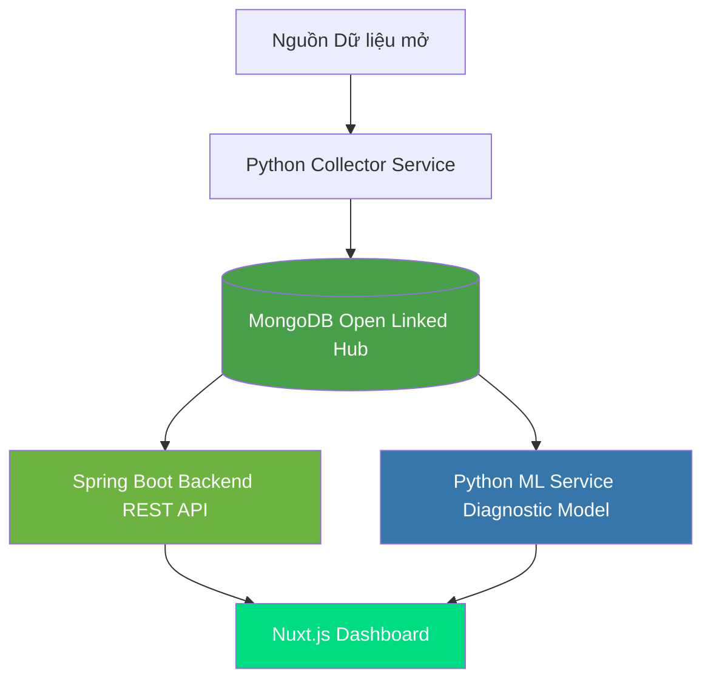

# Ldx-Insight Overview

**Local Digital Transformation Insight - Open Data Integration Platform**

## 💡 Problem Statement

Tại Việt Nam, các nguồn dữ liệu mở (như **data.gov.vn**, **opendata.mic.gov.vn**) đang:
- ❌ **Phân tán**: Nhiều nguồn khác nhau
- ❌ **Khó khai thác đồng bộ**: Không có công cụ tích hợp
- ❌ **Thiếu công cụ phân tích**: Không có ML diagnostic

## ✨ Solution

**Ldx-Insight** là nền tảng tích hợp dữ liệu mở tuân thủ kiến trúc nguồn mở, nhằm:

1. **📥 Thu thập (Collector):** Python script tự động crawl data từ nguồn mở
2. **🗄️ Chuẩn hóa (Database):** Normalize về JSON, lưu tập trung MongoDB
3. **🔌 Cung cấp (Backend):** Spring Boot 3 + REST API bảo mật
4. **📊 Phân tích (Frontend/ML):** 
   - Nuxt.js dashboard trực quan
   - Python ML service chẩnn đoán chỉ số chuyển đổi số

## 🎯 Key Features

### 1. Open Data Hub
- Tích hợp nhiều nguồn dữ liệu mở Việt Nam
- Chuẩn hóa format về JSON
- Lưu trữ tập trung MongoDB

### 2. ML Diagnostic Service
- Python ML service phân tích chỉ số
- Chẩn đoán mức độ chuyển đổi số địa phương
- API inference cho predictions

### 3. Modern Tech Stack
- **Backend**: Spring Boot 3 (Java 17)
- **Frontend**: Nuxt.js (Vue 3)
- **Database**: MongoDB
- **ML**: Python FastAPI/Flask

### 4. REST API
- OpenAPI/Swagger documentation
- Secure authentication
- Role-based access control

## 🏗️ System Architecture

## 📊 Use Cases

### 1. Data Integration
Tích hợp dữ liệu từ:
- data.gov.vn
- opendata.mic.gov.vn
- Các nguồn địa phương khác

### 2. Digital Transformation Index
Phân tích và chẩn đoán:
- Chỉ số chuyển đổi số
- Mức độ áp dụng công nghệ
- So sánh giữa các địa phương

### 3. Dashboard Visualization
- Biểu đồ trực quan
- Bảng thống kê
- Báo cáo tự động

## 🛠️ Tech Stack

| Component | Technology |
|-----------|-----------|
| **Backend** | Spring Boot 3 (Java 17) |
| **Frontend** | Nuxt.js (Vue 3) |
| **Database** | MongoDB |
| **ML Service** | Python (FastAPI/Flask) |
| **Collector** | Python (requests, pandas) |
| **DevOps** | Docker Compose |

## 🔗 Links

- **GitHub**: [Haui-HIT-H2K/Ldx-Insight](https://github.com/Haui-HIT-H2K/Ldx-Insight)
- **Documentation**: [https://haui-hit-h2k.github.io/Ldx-Insight/](https://haui-hit-h2k.github.io/Ldx-Insight/)
- **API**: [http://api.haui-hit-h2k.site/swagger-ui.html](http://api.haui-hit-h2k.site/swagger-ui/index.html)
- **Next**: [Architecture Details →](./architecture)
