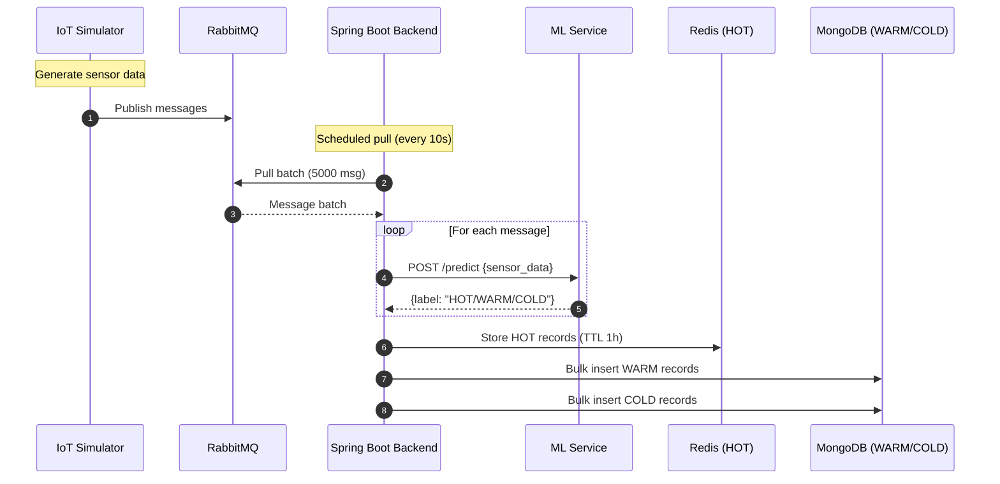
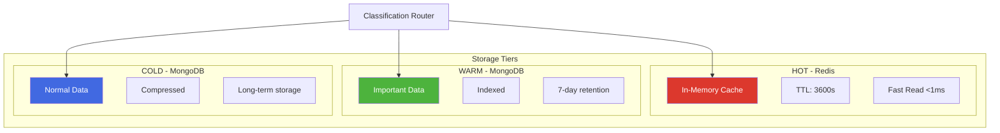
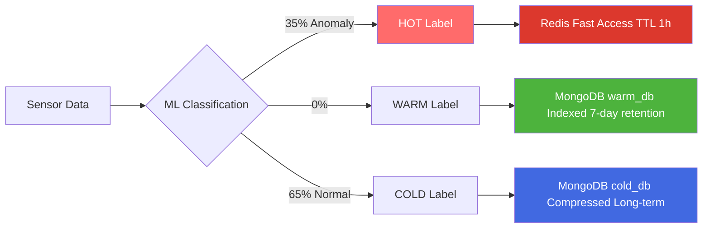

# System Architecture

## Pull-based Architecture



## Component Architecture

### 1. Data Generation Layer

**Python IoT Simulator**:
```python
# Simulate Temperature sensor
def generate_temperature():
    if random() < 0.35:  # 35% anomalies
        return uniform(40, 50)  # HOT anomaly
    else:
        return uniform(15, 35)  # Normal range
```

**Configuration**:
- 40M total messages
- 1000 simulated sensors
- 20 concurrent threads
- Random distribution

### 2. Edge Storage Layer

**RabbitMQ Clustering**:
- 2 nodes for high availability
- Queue: `smart_city_queue`
- Durable messages
- Ports: 5672, 5673 (AMQP), 15672, 15673 (Management UI)

**Benefits of Pull**:
- ✅ No backend overload during spikes
- ✅ Controlled batch processing
- ✅ Resilient if one node fails

### 3. Core Processing Layer

**Spring Boot Backend**:

**Scheduled Pull**:
```java
@Scheduled(fixedRate = 10000) // Every 10 seconds
public void pullMessages() {
    List<Message> batch = rabbitTemplate.receive(5000);
    
    // Classify with ML
    List<ClassifiedData> classified = mlService.classifyBatch(batch);
    
    // Route to appropriate storage
    routeToTieredStorage(classified);
}
```

**Tiered Routing Logic**:
```java
void routeToTieredStorage(List<ClassifiedData> data) {
    List<Data> hotData = filterByLabel(data, "HOT");
    List<Data> warmData = filterByLabel(data, "WARM");
    List<Data> coldData = filterByLabel(data, "COLD");
    
    redisTemplate.opsForValue().set(hotData);  // TTL 3600s
    warmMongoTemplate.insertAll(warmData);
    coldMongoTemplate.insertAll(coldData);
}
```

### 4. ML Classification Layer

**FastAPI ML Service**:

**IsolationForest Models**:
- `temperature_model.pkl` (1.5 MB)
- `humidity_model.pkl` (1.59 MB)
- `co2_model.pkl` (1.9 MB)

**Prediction Endpoint**:
```python
@app.post("/predict")
def predict(data: SensorData):
    metric_type = data.metric_type
    value = data.value
    
    # Load appropriate model
    model = models[metric_type]
    
    # Predict anomaly (-1 = anomaly, 1 = normal)
    prediction = model.predict([[value]])[0]
    
    if prediction == -1:
        return {"label": "HOT", "uri": "https://schema.org/Warning"}
    else:
        return {"label": "COLD", "uri": "https://schema.org/Normal"}
```

### 5. Tiered Storage Layer



**Redis Configuration**:
```yaml
redis:
  host: localhost
  port: 6379
  ttl: 3600  # 1 hour
```

**MongoDB Multi-Datasource**:
```yaml
spring:
  data:
    mongodb:
      warm:
        uri: mongodb://localhost:27018/warm_db
      cold:
        uri: mongodb://localhost:27019/cold_db
```

## Data Flow Visualization



## Deployment Architecture

**Docker Compose Services**:
1. `edge-rabbitmq-1`, `edge-rabbitmq-2` - Message queues
2. `core-redis-hot` - HOT tier cache
3. `core-mongo-warm` - WARM tier database
4. `core-mongo-cold` - COLD tier database  
5. `smart-city-backend` - Spring Boot API
6. `smart-city-ml` - ML classification service
7. `smart-city-frontend` - Nuxt.js dashboard

**Port Mapping**:
```
3000  - Frontend
5672/5673  - RabbitMQ AMQP
6379  - Redis
8000  - ML Service
8080  - Backend API
15672/15673 - RabbitMQ UI
27018/27019 - MongoDB instances
```

## Next Steps

- [ML Classification Deep Dive →](./ml-classification)
- [Technology Stack →](./tech-stack)
