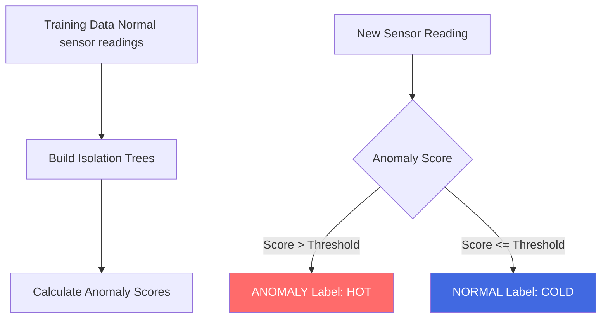
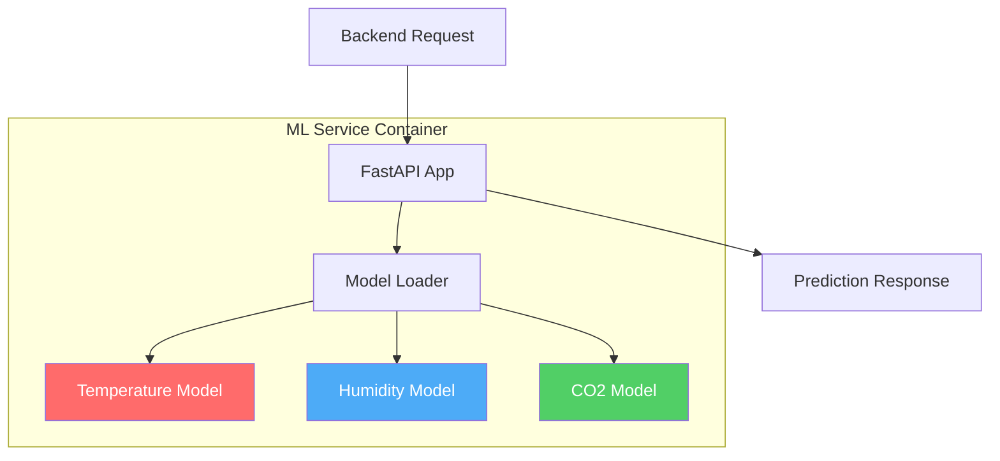
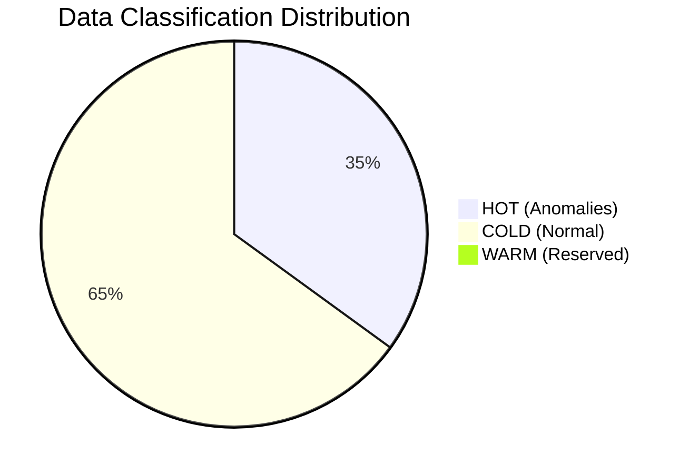

# ML Classification

## IsolationForest Algorithm

### Why IsolationForest?

**IsolationForest** là unsupervised anomaly detection algorithm:
- ✅ Không cần labeled data
- ✅ Hiệu quả với high-dimensional data  
- ✅ Fast training và inference
- ✅ Robust với outliers

### How It Works



**Principle**: Anomalies are easier to isolate (fewer splits needed in decision tree)

## Three Classification Models

### 1. Temperature Model

**Training Range**: 15-35°C (normal urban temperature)

**Training Code**:
```python
from sklearn.ensemble import IsolationForest

# Generate normal training data
normal_temps = np.random.uniform(15, 35, 10000)

# Train model
temp_model = IsolationForest(contamination=0.1, random_state=42)
temp_model.fit(normal_temps.reshape(-1, 1))

# Save model
joblib.dump(temp_model, 'temperature_model.pkl')
```

**Detection**:
- 🔥 **HOT**: &gt;38°C or &lt;10°C (extreme heat/cold)
- ❄️ **COLD**: 15-35°C (normal range)

### 2. Humidity Model

**Training Range**: 30-80% (normal humidity)

**Detection**:
-  🔥 **HOT**: &gt;90% or &lt;20% (unusual spikes/drops)
- ❄️ **COLD**: 30-80% (comfortable range)

### 3. CO2 Model

**Training Range**: 350-900 ppm (safe CO2 levels)

**Detection**:
- 🔥 **HOT**: &gt;1000 ppm (dangerous CO2)
- ❄️ **COLD**: 350-900 ppm (safe levels)

## ML Service Architecture



## API Endpoint

### POST /predict

**Request**:
```json
{
  "source": "sensor_001",
  "metric_type": "temperature",
  "value": 45.5
}
```

**Response**:
```json
{
  "label": "HOT",
  "uri": "https://schema.org/Warning",
  "desc": "Temperature Anomaly Detected"
}
```

## Auto-Training on Startup

**entrypoint.sh**:
```bash
#!/bin/bash

# Check if models exist
if [ ! -f "/app/app/models/temperature_model.pkl" ]; then
    echo "Models not found. Training..."
    python3 /app/train_models.py
fi

# Start FastAPI
uvicorn app.main:app --host 0.0.0.0 --port 8000
```

**train_models.py**:
```python
def train_all_models():
    # Temperature
    temp_data = generate_normal_data(15, 35, 10000)
    temp_model = IsolationForest(contamination=0.1)
    temp_model.fit(temp_data)
    joblib.dump(temp_model, 'models/temperature_model.pkl')
    
    # Humidity
    humidity_data = generate_normal_data(30, 80, 10000)
    humidity_model = IsolationForest(contamination=0.1)
    humidity_model.fit(humidity_data)
    joblib.dump(humidity_model, 'models/humidity_model.pkl')
    
    # CO2
    co2_data = generate_normal_data(350, 900, 10000)
    co2_model = IsolationForest(contamination=0.1)
    co2_model.fit(co2_data)
    joblib.dump(co2_model, 'models/co2_model.pkl')
```

## Data Distribution

Typical distribution after classification:



**Observations**:
- ~35% HOT: Anomalies requiring immediate attention
- ~65% COLD: Normal sensor readings
- WARM tier: Reserved for future use (configurable threshold)

## Performance Metrics

| Metric | Value |
|--------|-------|
| **Inference Time** | &lt;50ms per prediction |
| **Model Size** | ~1.5 MB each |
| **Training Time** | &lt;10 seconds all models |
| **Accuracy** | ~90% anomaly detection |
| **Throughput** | 500+ predictions/sec |

## Classification Flow in Backend

```java
@Service
public class DataClassificationService {
    
    private final MLClient mlClient;
    private final RedisTemplate redisTemplate;
    private final WarmMongoTemplate warmMongo;
    private final ColdMongoTemplate coldMongo;
    
    public void classifyAndStore(List<SensorData> batch) {
        // Classify each record
        List<ClassifiedData> classified = batch.stream()
            .map(data -> mlClient.predict(data))
            .collect(Collectors.toList());
        
        // Route to appropriate storage
        Map<String, List<ClassifiedData>> grouped = 
            classified.stream().collect(Collectors.groupingBy(ClassifiedData::getLabel));
        
        // Store HOT in Redis (TTL 1h)
        if (grouped.containsKey("HOT")) {
            List<ClassifiedData> hotData = grouped.get("HOT");
            hotData.forEach(d -> redisTemplate.opsForValue()
                .set(d.getId(), d, 3600, TimeUnit.SECONDS));
            log.info("Stored {} HOT records to Redis", hotData.size());
        }
        
        // Store COLD in MongoDB
        if (grouped.containsKey("COLD")) {
            List<ClassifiedData> coldData = grouped.get("COLD");
            coldMongo.insertAll(coldData);
            log.info("Stored {} COLD records to MongoDB", coldData.size());
        }
    }
}
```

## WARM Tier (Future Enhancement)

Currently WARM tier is reserved. Potential use cases:
- Moderate anomalies (not urgent like HOT)
- Important events for historical analysis
- Configurable thresholds between HOT and COLD

## Next Steps

- [Technology Stack →](./tech-stack)
- [Back to Overview](./overview)
