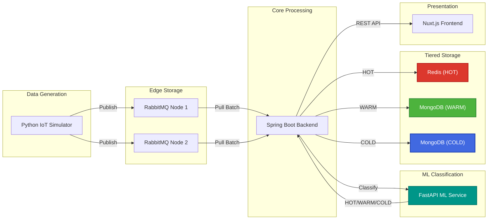

# SmartCity Platform Overview

**Smart Urban Data Platform with Tiered Storage & ML Classification**

## 💡 Problem Statement

Trong các hệ thống IoT đô thị thông minh:
- ❌ **Overload**: Millions of sensor messages làm quá tải hệ thống
- ❌ **Storage inefficiency**: Không phân biệt data quan trọng vs thông thường
- ❌ **Processing bottleneck**: Push-based architecture dễ overwhelm backend

## ✨ Solution

**SmartCity Platform** là nền tảng IoT với kiến trúc tiên tiến:

### 1. ML-Driven Classification 🤖
- **IsolationForest** models phân loại tự động
- 3 tiers: **HOT** (urgent) / **WARM** (important) / **COLD** (normal)
- Real-time anomaly detection

### 2. Tiered Storage Architecture 💾
- **HOT tier**: Redis (in-memory, TTL 1h) cho real-time
- **WARM/COLD tiers**: MongoDB cho persistent storage
- Optimize cost vs performance

### 3. Pull-based Architecture 🔄
- Backend **PULL** từ RabbitMQ edge storage
- Batch processing (5000 msg/lần)
- Resilient - không quá tải khi data spike

## 🎯 Key Features

### 1. Automatic Data Classification
```
Sensor Data → ML Service → HOT/WARM/COLD label
```
- Temperature anomalies → HOT
- Humidity spikes → HOT/WARM
- Normal readings → COLD

### 2. Scalable IoT Ingestion
- Handle **40M+ messages**  
- ~500 messages/second throughput
- Multi-node RabbitMQ for HA

### 3. Intelligent Routing
```
HOT → Redis (fast access)
WARM → MongoDB warm_db
COLD → MongoDB cold_db
```

## 🏗️ System Architecture



## 📊 Performance Metrics

| Metric | Value |
|--------|-------|
| **Throughput** | ~500 msg/sec |
| **Batch Size** | 5,000 msg/pull |
| **ML Latency** | &lt;50ms per classification |
| **Scale** | 40M+ messages tested |
| **HOT TTL** | 3600s (1 hour) |

## 🛠️ Tech Stack

| Component | Technology |
|-----------|-----------|
| **Backend** | Spring Boot 3.2 (Java 17) |
| **ML Service** | FastAPI (Python) |
| **Message Queue** | RabbitMQ 3 |
| **Cache** | Redis Alpine |
| **Database** | MongoDB 7.0 (2 instances) |
| **Frontend** | Nuxt.js 3 |
| **Simulator** | Python 3.10 + Faker |

## 🔗 Links

- **GitHub**: [Haui-HIT-H2K/SmartCity-Platform](https://github.com/Haui-HIT-H2K/SmartCity-Platform)
- **Documentation**: [https://Haui-HIT-H2K.github.io/SmartCity-Platform/](https://Haui-HIT-H2K.github.io/SmartCity-Platform/)
- **Next**: [Architecture Details →](./architecture)
